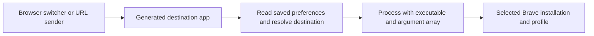

# Architecture and routing contract

| Module | Responsibility |
| --- | --- |
| `BraveDestinations` | Read-only discovery, stable identity, validation, URL handling, launch requests, `Process` handoff |
| `AppPackaging` | Bundle generation, icons, ownership checks, local signing and Launch Services registration |
| `ContainerReceiver` | Resident AppKit URL receiver and error alerts |
| `ContainerSetup` | Native destination and appearance editor |
| `CBC` | CLI; installed executable remains `cbc` |



The default browser is not involved in the receiver-to-Brave handoff. The adapter does not install a picker, rules engine, browser extension, daemon, or backend.

## Compatibility identifiers

The repository name is `brave-container-adapter`. Existing bundle IDs retain the `app.choosy-brave-containers` prefix. The setup app remains **Brave Container Setup**, and the CLI remains **cbc**. These are compatibility identifiers, not a dependency on a particular switcher. Do not rename them as a cosmetic cleanup.

Named identity hashes canonical installation path, user data path, profile directory and container ID using length-prefixed UTF-8 inputs. Temporary identity includes a separate mode marker instead of an ephemeral ID. Configuration format 1 remains valid for named destinations; format 2 supports temporary destinations. Profile/container display names and app appearance do not change identity.

New installs use `~/Applications/Brave Destinations/`. Discovery also checks the legacy `~/Applications/Choosy Brave Containers/` folder. Existing apps update in their current folder.

## Discover profiles and containers

```bash
dist/bin/cbc list
dist/bin/cbc list --profile 'Profile 1'
dist/bin/cbc doctor
```

Standard locations:

- Installation: `/Applications/Brave Browser.app`
- Data: `~/Library/Application Support/BraveSoftware/Brave-Browser`

Every discovery/generation command accepts overrides:

```bash
dist/bin/cbc list \
  --brave '/Applications/Brave Browser.app' \
  --user-data-dir "$HOME/Library/Application Support/BraveSoftware/Brave-Browser"
```

`Local State` → `profile.info_cache` supplies the profile **directory key** and display name. Pass `Default` or `Profile 1` to `--profile`, not a display name such as `Personal`.

The selected profile's `Preferences` contains nested `brave.containers` data:

| Key | Meaning |
| --- | --- |
| `enabled` | Explicit saved enablement; this adapter requires `true` |
| `list` | Configured containers, each with `id`, `name`, integer `icon` and `background_color` |
| `used` | Dictionary keyed by ID; retained local snapshots, including potentially deleted containers |

Only configured entries become named destinations. Temporary mode creates a fresh container; retained temporary IDs are never offered as reusable destinations. Retained entries are counted separately. A retained-only ID is rejected. Brave searches configured names before retained names, so a retained name does not shadow a configured destination. Duplicate **configured** names block that name's launch; duplicate IDs or malformed records block discovery.

### Built-in containers and delayed saves

Brave may show its built-in Personal/Work/Social/School containers while `list` is absent from the file. These are localized runtime defaults, not evidence that `used` is the configured list. **Add a container or edit and save one in Brave's UI**, then wait until `cbc list` shows the configured entries. The adapter does not guess localized names or synthesize default records. Temporary mode does not need a saved `list`. Both modes require explicit saved `enabled: true`, even if a Brave experiment enables the UI by default.

Brave writes preferences asynchronously. `cbc list` shows the saved state, which can lag the UI. After changing container settings, wait for the new state to appear before opening links. Close/reopen the test browser if a save does not appear. The reader retries failed, partial, or changing file reads three times; it never writes these files.
Preference files are limited to 16 MiB, configuration/plist files to 1 MiB, and icon
files to 32 MiB. Reads reject non-regular files and final-component symlinks, enforce
limits while reading, and check inode, timestamps and size before and after the read.
These bounds limit memory use; they are not a wall-clock guarantee for a stalled filesystem.

## URL delivery and errors

The app declares HTTP/HTTPS URL handling and runs as an AppKit accessory app. It has no normal window or persistent Dock icon. It stays resident until quit/logout so an idle timeout cannot discard a late URL event. Multiple events and batched URLs are supported; repeated URLs are not deduplicated. Incoming events received during an error alert are queued within the limits below.

Requests accept at most 128 URLs, 64 KiB per URL and 128 KiB of URL text per batch.
The pending queue holds at most 32 batches and 1 MiB of URL text. An overflow rejects
the new batch, preserves previously accepted batches and shows a bounded error alert.
A native URL-event sender also receives an Apple-event error. Accepted duplicates
remain distinct requests. Only one destination-resolution task drains the queue.

The receiver validates the entire incoming batch, loads its destination, and reads the latest saved preferences. For a named destination, it resolves the configured ID to its current name and constructs:

```text
/path/to/Brave.app/Contents/MacOS/Brave Browser
  --user-data-dir=/path/to/data
  --profile-directory=Default
  --container=Current Name
  --
  https://example.com/...
```

For Temporary, `--temporary-container` replaces `--container=Current Name`. It never sends both switches; a container name would make Brave reuse a named temporary container.

These are separate `Process.arguments` elements, not a shell command. `open -a Brave --args` is not used. Brave handles its existing-instance handoff. The adapter uses Chromium's POSIX hostname (`gethostname`), not Foundation's potentially different DNS name. It checks the data directory's singleton owner and rejects a different running installation or an owner it cannot establish. A malformed, foreign-host or unreadable singleton lock fails closed. A stale lock with no live process permits launch. Activation targets that browser process after the handoff; a live check must still confirm the intended profile window. Failure to confirm foreground activation within about nine seconds produces an error; it does not resend the URL.

HTTP/HTTPS text from raw URL Apple events is passed unchanged after validation, including percent escapes, Unicode, queries and fragments. AppKit-batched URLs use the representation AppKit supplies; the adapter cannot undo normalization already performed by a sender or macOS. Unsupported schemes, invalid escapes, whitespace/control characters, and empty hosts are rejected. Batches larger than the conservative 128 KiB argument budget are rejected with an error; split them into smaller batches.

Errors appear in a native alert. The CLI prints metadata diagnostics to the terminal. Neither logs incoming URLs or query values. Brave stdout/stderr are suppressed. `list` and `doctor` intentionally display local profile/container names and IDs; review those before sharing diagnostics. Normal OS process inspection can see command-line arguments, and Brave itself handles the URLs as usual.


## Bundle contents and updates

Each destination contains `ContainerReceiver`, `Info.plist`, `destination.json`, `appearance.json`, and `Destination.icns`. Configuration has owner-only file permissions. It is plaintext and contains local paths and container identity. It is not a portable distribution artifact.

The generator checks its ownership marker and the derived bundle ID, rejects symlinks and unrelated filename collisions, locks the output folder, stages and verifies the app, then uses exclusive rename or atomic swap. A rename plus replacement is two filesystem operations, not a single transaction. Error handling attempts to restore the old name; a failed rollback reports where the original app remains. Running receivers must be quit before updating.

Signing and registration run off the main thread with a 15-second timeout. Setup
allows cancellation while they run. A cancellation before the filesystem commit
preserves the previous app. Cancellation after installation may leave the new app
installed but not registered; inspect the app directory before retrying. Timeout
and cancellation terminate only the helper process started by this operation.
Hidden abandoned staging bundles are ignored during discovery and preserved for
inspection. The generator does not claim a crash-safe multi-operation transaction.

Ownership markers identify managed bundles. They do not authenticate an untrusted bundle supplied by another person. Installation and data path overrides are trusted local user choices. The adapter checks Brave's filename and version metadata, but does not verify its vendor signature.

## Limits and guarantees

- Discovery depends on **Brave's internal preference storage format**, not a supported external API. Future Brave changes may require an adapter update.
- Named routing currently relies on **container names**, even though destination configuration stores an ID. Temporary routing uses the bare `--temporary-container` switch. The inspected implementation compares names exactly and uses the first matching configured record.
- There is an unavoidable gap between saved-file validation and Brave processing the request. In-memory state can differ from disk; flags, profile selection, container names, deletion, or enablement can change during that gap. A missed name can cause Brave itself to open an ordinary tab or use a retained record. The adapter never intentionally selects a fallback, but **cannot guarantee isolation across this race or verify the final tab**. This is not a security boundary. After changes, wait for saved state; verify badges before sensitive browsing.
- Temporary containers follow Brave's retention and restoration rules. Closing their last tab does not guarantee that data is erased.
- Effective feature rollout/command-line overrides cannot be fully inferred from saved files. Explicit `containers@2` is rejected, but a contradictory running-process flag or future rollout change still needs a GUI check.
- Browser startup/onboarding, a profile picker, crash recovery, a locked profile, or a broken Brave process can interrupt handoff. Initialize each profile manually before generating apps. The CLI does not read cookies, history, or internal Mojo settings interfaces.
- Early UI tests used an isolated copy with a distinct bundle identifier. Version 1.4.0 also received unmodified vendor-Brave checks with disposable profiles after the owner approved briefly quitting personal Brave. See the [current verification record](verification-1.4.0.md) for exact coverage.

## Source references

The original named integration used the **1.92.140 tag**. Temporary support was checked against the installed **1.95.101 tag**, not `main`:

- [Startup command-line container handling](https://github.com/brave/brave-core/blob/v1.92.140/browser/ui/startup/brave_startup_tab_provider_impl.cc)
- [Preference keys](https://github.com/brave/brave-core/blob/v1.92.140/components/containers/core/browser/pref_names.h) and [serialization](https://github.com/brave/brave-core/blob/v1.92.140/components/containers/core/browser/prefs.cc)
- [Configured-first runtime lookup](https://github.com/brave/brave-core/blob/v1.92.140/components/containers/core/browser/containers_service.cc)
- [Preference defaults](https://github.com/brave/brave-core/blob/v1.92.140/components/containers/core/browser/prefs_registration.cc) and [localized default containers](https://github.com/brave/brave-core/blob/v1.92.140/components/containers/core/browser/default_containers_list.cc)

- [Temporary command-line contract](https://github.com/brave/brave-core/blob/v1.95.101/components/containers/core/browser/command_line_container.h) and [implementation](https://github.com/brave/brave-core/blob/v1.95.101/components/containers/core/browser/command_line_container.cc)
- [Temporary container lifecycle](https://github.com/brave/brave-core/blob/v1.95.101/components/containers/core/browser/containers_service.cc) and [tab/session references used for cleanup](https://github.com/brave/brave-core/blob/v1.95.101/browser/containers/containers_service_delegate.cc)
